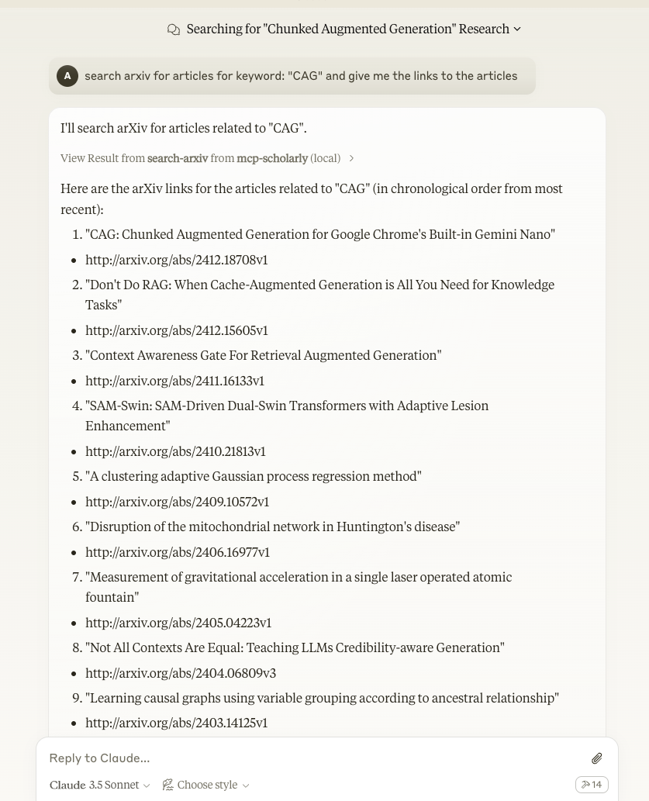

# mcp-scholarly MCP server

A MCP server to search for accurate academic articles. More scholarly vendors will be added soon.



<a href="https://glama.ai/mcp/servers/aq05b2p0ql"></a>

## Components

### Tools

The server implements one tool:
- search-arxiv: Search arxiv for articles related to the given keyword.
  - Takes "keyword" as required string arguments

## Quickstart

### Install

#### Claude Desktop

On MacOS: `~/Library/Application\ Support/Claude/claude_desktop_config.json`
On Windows: `%APPDATA%/Claude/claude_desktop_config.json`

<details>
  <summary>Development/Unpublished Servers Configuration</summary>
  ```
  "mcpServers": {
    "mcp-scholarly": {
      "command": "uv",
      "args": [
        "--directory",
        "/Users/adityakarnam/PycharmProjects/mcp-scholarly/mcp-scholarly",
        "run",
        "mcp-scholarly"
      ]
    }
  }
  ```
</details>

<details>
  <summary>Published Servers Configuration</summary>
  ```
  "mcpServers": {
    "mcp-scholarly": {
      "command": "uvx",
      "args": [
        "mcp-scholarly"
      ]
    }
  }
  ```
</details>

## Development

### Building and Publishing

To prepare the package for distribution:

1. Sync dependencies and update lockfile:
```bash
uv sync
```

2. Build package distributions:
```bash
uv build
```

This will create source and wheel distributions in the `dist/` directory.

3. Publish to PyPI:
```bash
uv publish
```

Note: You'll need to set PyPI credentials via environment variables or command flags:
- Token: `--token` or `UV_PUBLISH_TOKEN`
- Or username/password: `--username`/`UV_PUBLISH_USERNAME` and `--password`/`UV_PUBLISH_PASSWORD`

### Debugging

Since MCP servers run over stdio, debugging can be challenging. For the best debugging
experience, we strongly recommend using the [MCP Inspector](https://github.com/modelcontextprotocol/inspector).


You can launch the MCP Inspector via [`npm`](https://docs.npmjs.com/downloading-and-installing-node-js-and-npm) with this command:

```bash
npx @modelcontextprotocol/inspector uv --directory /Users/adityakarnam/PycharmProjects/mcp-scholarly/mcp-scholarly run mcp-scholarly
```


Upon launching, the Inspector will display a URL that you can access in your browser to begin debugging.
